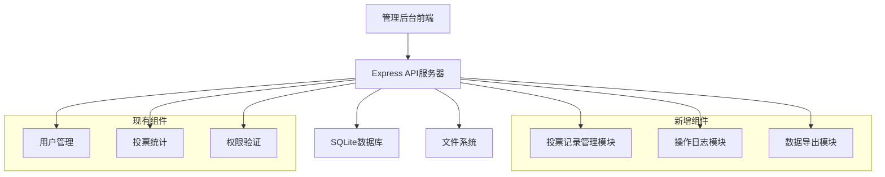
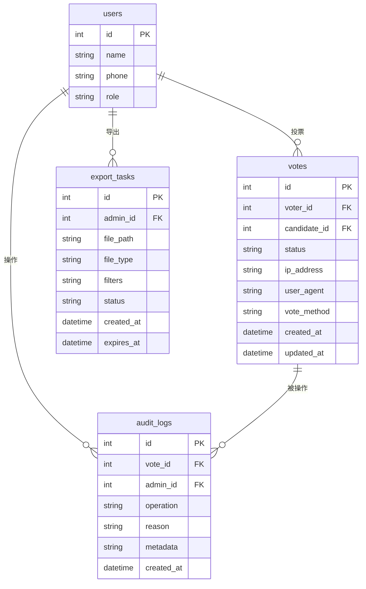

# 设计文档

## 概述

本设计文档描述了为现有年会投票系统增加管理后台投票记录功能的技术实现方案。该功能将扩展现有的管理后台，提供投票记录的详细查看、有效性管理、筛选搜索、批量操作、操作日志和数据导出等功能。

设计基于现有的Node.js + Express + SQLite架构，通过扩展现有的数据库结构和API接口来实现新功能，同时保持与现有系统的兼容性。

## 架构

### 系统架构概述



### 技术栈扩展

- **后端**: 继续使用Node.js + Express框架
- **数据库**: 扩展现有SQLite数据库结构
- **前端**: 扩展现有管理后台HTML/CSS/JavaScript
- **新增依赖**: 
  - `csv-writer`: 用于CSV导出
  - `exceljs`: 用于Excel导出
  - `moment`: 用于时间处理

## 组件和接口

### 1. 投票记录管理模块 (VoteRecordManager)

**职责**: 处理投票记录的查询、筛选和状态管理

**主要方法**:
```javascript
class VoteRecordManager {
  // 获取投票记录列表（支持筛选和分页）
  async getVoteRecords(filters, pagination)
  
  // 获取单个投票记录详情
  async getVoteRecordDetail(voteId)
  
  // 更新投票记录状态
  async updateVoteStatus(voteId, status, adminId, reason)
  
  // 批量更新投票记录状态
  async batchUpdateVoteStatus(voteIds, status, adminId, reason)
  
  // 搜索投票记录
  async searchVoteRecords(searchTerm, filters)
}
```

### 2. 操作日志模块 (AuditLogManager)

**职责**: 记录和查询管理员操作日志

**主要方法**:
```javascript
class AuditLogManager {
  // 记录操作日志
  async logOperation(voteId, adminId, operation, reason, metadata)
  
  // 获取投票记录的操作历史
  async getVoteOperationHistory(voteId)
  
  // 获取管理员操作日志
  async getAdminOperationLogs(adminId, dateRange)
}
```

### 3. 数据导出模块 (DataExportManager)

**职责**: 处理投票记录数据的导出功能

**主要方法**:
```javascript
class DataExportManager {
  // 导出CSV格式数据
  async exportToCSV(filters, columns)
  
  // 导出Excel格式数据
  async exportToExcel(filters, columns)
  
  // 生成导出文件下载链接
  async generateDownloadLink(filePath)
  
  // 清理过期的导出文件
  async cleanupExpiredFiles()
}
```

### 4. API接口设计

#### 投票记录相关接口

```javascript
// GET /api/admin/vote-records - 获取投票记录列表
// 查询参数: page, limit, status, voter, candidate, dateFrom, dateTo
app.get('/api/admin/vote-records', authenticateAdmin, async (req, res) => {
  // 实现投票记录列表查询
});

// GET /api/admin/vote-records/:id - 获取投票记录详情
app.get('/api/admin/vote-records/:id', authenticateAdmin, async (req, res) => {
  // 实现投票记录详情查询
});

// PUT /api/admin/vote-records/:id/status - 更新投票记录状态
app.put('/api/admin/vote-records/:id/status', authenticateAdmin, async (req, res) => {
  // 实现投票记录状态更新
});

// PUT /api/admin/vote-records/batch-status - 批量更新投票记录状态
app.put('/api/admin/vote-records/batch-status', authenticateAdmin, async (req, res) => {
  // 实现批量状态更新
});

// GET /api/admin/vote-records/:id/history - 获取投票记录操作历史
app.get('/api/admin/vote-records/:id/history', authenticateAdmin, async (req, res) => {
  // 实现操作历史查询
});
```

#### 数据导出相关接口

```javascript
// POST /api/admin/export/vote-records - 创建导出任务
app.post('/api/admin/export/vote-records', authenticateAdmin, async (req, res) => {
  // 实现数据导出任务创建
});

// GET /api/admin/export/:taskId/download - 下载导出文件
app.get('/api/admin/export/:taskId/download', authenticateAdmin, async (req, res) => {
  // 实现导出文件下载
});
```

## 数据模型

### 现有表结构扩展

#### 1. votes表扩展
```sql
-- 为现有votes表添加新字段
ALTER TABLE votes ADD COLUMN status TEXT DEFAULT 'active'; -- 'active' 或 'inactive'
ALTER TABLE votes ADD COLUMN ip_address TEXT;
ALTER TABLE votes ADD COLUMN user_agent TEXT;
ALTER TABLE votes ADD COLUMN vote_method TEXT; -- 'qr_code' 或 'name_search'
ALTER TABLE votes ADD COLUMN created_at DATETIME DEFAULT CURRENT_TIMESTAMP;
ALTER TABLE votes ADD COLUMN updated_at DATETIME DEFAULT CURRENT_TIMESTAMP;
```

#### 2. 新增audit_logs表
```sql
CREATE TABLE audit_logs (
  id INTEGER PRIMARY KEY AUTOINCREMENT,
  vote_id INTEGER NOT NULL,
  admin_id INTEGER NOT NULL,
  operation TEXT NOT NULL, -- 'deactivate', 'activate'
  reason TEXT,
  metadata TEXT, -- JSON格式的额外信息
  created_at DATETIME DEFAULT CURRENT_TIMESTAMP,
  FOREIGN KEY (vote_id) REFERENCES votes(id),
  FOREIGN KEY (admin_id) REFERENCES users(id)
);
```

#### 3. 新增export_tasks表
```sql
CREATE TABLE export_tasks (
  id INTEGER PRIMARY KEY AUTOINCREMENT,
  admin_id INTEGER NOT NULL,
  file_path TEXT NOT NULL,
  file_type TEXT NOT NULL, -- 'csv' 或 'excel'
  filters TEXT, -- JSON格式的筛选条件
  status TEXT DEFAULT 'pending', -- 'pending', 'completed', 'failed'
  created_at DATETIME DEFAULT CURRENT_TIMESTAMP,
  expires_at DATETIME,
  FOREIGN KEY (admin_id) REFERENCES users(id)
);
```

### 数据关系图



## 正确性属性

*属性是一个特征或行为，应该在系统的所有有效执行中保持为真——本质上是关于系统应该做什么的正式声明。属性作为人类可读规范和机器可验证正确性保证之间的桥梁。*

基于需求分析和预工作分析，以下是系统必须满足的正确性属性：

### 属性 1: 投票记录渲染完整性
*对于任何*投票记录，渲染函数应该包含投票者姓名、被投票者姓名、投票时间、投票状态，以及在详情视图中包含IP地址、用户代理信息和投票方式
**验证需求: 需求 1.2, 1.4**

### 属性 2: 状态变化操作正确性
*对于任何*投票记录，当执行作废操作时，记录状态应变为无效且统计数据应更新；当执行恢复操作时，记录状态应变为有效且统计数据应更新
**验证需求: 需求 2.2, 2.4, 2.5**

### 属性 3: UI操作选项状态相关性
*对于任何*投票记录，有效记录应显示作废操作选项，无效记录应显示恢复操作选项
**验证需求: 需求 2.1, 2.3**

### 属性 4: 搜索功能正确性
*对于任何*搜索查询，返回的结果应该只包含投票者姓名或被投票者姓名匹配搜索词的记录
**验证需求: 需求 3.1, 3.2**

### 属性 5: 筛选功能正确性
*对于任何*筛选条件（状态、时间范围），返回的结果应该只包含符合所有筛选条件的记录
**验证需求: 需求 3.3, 3.4**

### 属性 6: 批量操作功能性
*对于任何*选中的多条投票记录，系统应提供相应的批量操作选项，并在执行后显示操作进度和结果统计
**验证需求: 需求 4.1, 4.2, 4.3, 4.4**

### 属性 7: 操作日志记录完整性
*对于任何*管理员操作（作废或恢复），系统应记录包含操作时间、操作人和操作原因的完整日志信息
**验证需求: 需求 5.1, 5.2**

### 属性 8: 操作历史显示正确性
*对于任何*有操作历史的投票记录，显示的操作历史应包含所有相关操作且按时间倒序排列
**验证需求: 需求 5.3, 5.4**

### 属性 9: 数据导出完整性
*对于任何*导出请求，导出的数据应包含当前筛选条件下的所有记录和所有相关字段信息
**验证需求: 需求 6.1, 6.2**

### 属性 10: 导出格式支持性
*对于任何*有效的投票记录数据，系统应能够生成有效的CSV和Excel格式文件
**验证需求: 需求 6.3, 6.4**

### 属性 11: 权限验证正确性
*对于任何*用户访问请求，只有具有管理员权限的用户应能访问投票记录管理功能，未授权用户应被重定向到登录页面
**验证需求: 需求 7.1, 7.2**

### 属性 12: 敏感操作确认机制
*对于任何*敏感操作（批量作废、批量恢复），系统应要求用户进行二次确认
**验证需求: 需求 7.3**

### 属性 13: 会话管理正确性
*对于任何*超时的管理员会话，系统应自动注销用户并要求重新认证
**验证需求: 需求 7.5**

### 属性 14: 响应式布局自适应性
*对于任何*屏幕尺寸变化，系统应自动调整界面布局以适应新的屏幕尺寸
**验证需求: 需求 8.4**

### 属性 15: 触摸设备交互适配性
*对于任何*触摸设备，系统应提供适合触摸操作的交互元素尺寸和行为
**验证需求: 需求 8.5**

## 错误处理

### 1. 数据库操作错误处理

**连接错误**:
- 数据库连接失败时，返回HTTP 500状态码和友好错误信息
- 实现连接重试机制，最多重试3次
- 记录详细错误日志用于调试

**查询错误**:
- SQL查询错误时，返回HTTP 400状态码和具体错误信息
- 对用户输入进行参数化查询防止SQL注入
- 验证查询参数的有效性

**事务错误**:
- 批量操作失败时，回滚所有相关更改
- 记录失败的具体记录ID和错误原因
- 返回部分成功的操作结果

### 2. 文件操作错误处理

**导出文件生成错误**:
- 文件生成失败时，清理临时文件
- 返回具体的错误信息给用户
- 记录错误日志包含失败原因

**文件下载错误**:
- 文件不存在时，返回HTTP 404状态码
- 文件过期时，返回HTTP 410状态码
- 文件访问权限错误时，返回HTTP 403状态码

### 3. 权限和认证错误处理

**认证失败**:
- 未登录用户访问时，重定向到登录页面
- 会话过期时，清理客户端存储的认证信息
- 返回明确的认证错误信息

**权限不足**:
- 非管理员用户访问时，返回HTTP 403状态码
- 记录未授权访问尝试的安全日志
- 显示友好的权限不足提示信息

### 4. 输入验证错误处理

**参数验证**:
- 必需参数缺失时，返回HTTP 400状态码和具体缺失参数
- 参数格式错误时，返回详细的格式要求说明
- 参数值超出范围时，返回有效范围信息

**数据完整性验证**:
- 投票记录不存在时，返回HTTP 404状态码
- 状态转换无效时，返回当前状态和允许的转换
- 外键约束违反时，返回相关实体信息

## 测试策略

### 双重测试方法

本系统采用单元测试和基于属性的测试相结合的方法：

**单元测试**:
- 验证具体示例、边界情况和错误条件
- 测试特定的业务逻辑和集成点
- 关注具体的输入输出场景

**基于属性的测试**:
- 验证跨所有输入的通用属性
- 通过随机化实现全面的输入覆盖
- 每个属性测试最少运行100次迭代

### 测试配置

**基于属性的测试库**: 使用`fast-check`库进行JavaScript的基于属性测试

**测试标记格式**: 每个属性测试必须包含注释引用设计文档属性
- 标记格式: **Feature: admin-vote-records, Property {number}: {property_text}**

**测试覆盖范围**:
- 所有API端点的功能测试
- 数据库操作的完整性测试
- 用户界面交互的行为测试
- 权限和安全机制的验证测试
- 错误处理和边界条件的测试

### 单元测试重点

**具体示例测试**:
- 桌面设备访问显示完整表格视图
- 平板设备访问调整布局适应屏幕
- 移动设备访问提供简化卡片视图
- 特定错误条件的处理验证

**集成点测试**:
- API端点与数据库的集成
- 前端与后端的数据交互
- 文件导出和下载流程
- 权限验证中间件的集成

**边界条件测试**:
- 大量数据的分页处理
- 导出文件的大小限制
- 并发操作的数据一致性
- 会话超时的边界情况

### 基于属性的测试重点

**数据生成策略**:
- 生成各种有效和无效的投票记录
- 生成不同权限级别的用户数据
- 生成各种筛选和搜索条件
- 生成不同的操作序列和状态转换

**属性验证重点**:
- 数据完整性和一致性属性
- 状态转换的正确性属性
- 搜索和筛选的准确性属性
- 权限控制的安全性属性

每个正确性属性必须通过单个基于属性的测试实现，确保系统在各种输入条件下的正确行为。