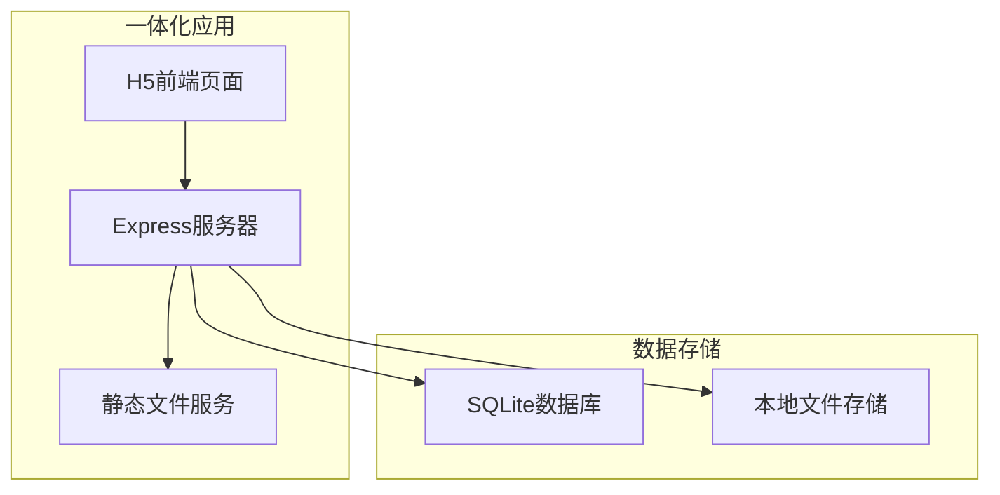
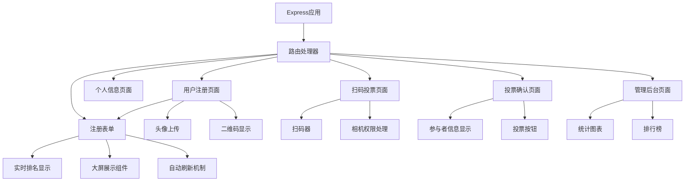

# 设计文档

## 概述

年会最佳服装评选H5应用是一个基于Web技术的移动端投票系统。系统采用前后端分离架构，前端使用HTML5、CSS3和JavaScript构建响应式移动端界面，后端提供RESTful API服务。核心功能包括用户注册、二维码生成扫描、投票管理和结果统计。

系统设计重点关注移动端用户体验、投票公平性保障和实时数据同步。通过二维码技术实现快速身份识别，通过投票限制机制确保公平性，通过实时统计提供即时反馈。

## 架构

### 整体架构

系统采用一体化架构模式，前后端集成部署：



### 技术栈选择

**一体化技术栈:**
- Node.js + Express - 服务器和API
- HTML5 + CSS3 + JavaScript - 前端页面（服务器渲染或静态文件）
- qrcode.js - 二维码生成库
- html5-qrcode - 二维码扫描库
- SQLite - 轻量级本地数据库
- 本地文件存储 - 头像文件直接存储在服务器

**部署架构:**
- 单一应用部署: Express服务器同时提供前端页面和API服务
- 数据库: SQLite文件数据库
- 文件存储: 服务器本地存储
- 部署平台: 可使用免费云服务如Railway、Render等

## 组件和接口

### 前端组件架构



### 核心组件说明

**1. Express路由处理器**
- 功能: 处理页面路由和API请求
- 页面路由: 渲染HTML页面
- API路由: 处理数据请求和响应

**2. 用户注册处理**
- 功能: 处理用户基本信息输入和验证
- 输入: 姓名、性别选择
- 输出: 用户ID、默认头像分配
- 路由: POST /register

**3. 头像管理**
- 功能: 头像上传、预览和更新
- 支持格式: JPG, PNG (最大2MB)
- 路由: POST /upload-avatar

**4. 二维码生成**
- 功能: 基于用户ID生成唯一二维码
- 库依赖: qrcode.js
- 格式: JSON字符串包含用户ID和验证信息

**5. 二维码扫描**
- 功能: 调用摄像头扫描二维码
- 库依赖: html5-qrcode
- 权限处理: 相机访问权限请求和错误处理

**6. 投票管理**
- 功能: 投票逻辑处理和限制检查
- 验证: 重复投票检查、性别分类投票
- 路由: POST /vote

**7. 统计展示**
- 功能: 实时投票结果展示
- 数据更新: 页面刷新或简单轮询
- 路由: GET /statistics

**8. 电脑端排名展示**
- 功能: 大屏幕实时排名显示，适合投影或大屏展示
- 特点: 自动刷新、响应式布局、适配电脑端浏览器
- 路由: GET /ranking-display

**9. 用户列表展示**
- 功能: 显示所有已注册用户的列表，支持点击投票
- 特点: 响应式网格布局、实时搜索过滤、移动端优化
- 路由: GET /user-list

**10. 搜索和过滤**
- 功能: 实时搜索用户姓名和数字ID
- 特点: 模糊匹配、即时过滤、搜索结果高亮
- 集成: 嵌入在用户列表页面中
- 功能: 大屏幕实时排名显示，适合投影或大屏展示
- 特点: 自动刷新、响应式布局、适配电脑端浏览器
- 路由: GET /ranking-display

### API接口设计

**用户管理路由:**

```javascript
// 用户注册
POST /register
{
  "name": "张三",
  "gender": "male"
}
Response: {
  "userId": "uuid",
  "qrCode": "base64_string",
  "avatarUrl": "default_avatar_url"
}

// 头像上传
POST /upload-avatar
Content-Type: multipart/form-data
Response: {
  "avatarUrl": "new_avatar_url"
}

// 获取用户信息
GET /user/:userId
Response: {
  "userId": "uuid",
  "name": "张三",
  "gender": "male",
  "avatarUrl": "avatar_url",
  "voteCount": 5
}
```

**投票管理路由:**

```javascript
// 投票
POST /vote
{
  "voterId": "voter_uuid",
  "targetUserId": "target_uuid"
}
Response: {
  "success": true,
  "message": "投票成功"
}

// 检查投票状态
GET /vote-status/:voterId
Response: {
  "maleVoted": true,
  "femaleVoted": false,
  "votedUsers": ["uuid1", "uuid2"]
}
```

**统计查询路由:**

```javascript
// 获取排行榜
GET /ranking
Response: {
  "male": [
    {
      "userId": "uuid",
      "name": "张三",
      "avatarUrl": "url",
      "voteCount": 15,
      "rank": 1
    }
  ],
  "female": [...]
}

// 获取实时统计
GET /statistics
Response: {
  "totalParticipants": 50,
  "totalVotes": 80,
  "maleParticipants": 25,
  "femaleParticipants": 25
}
```

**页面路由:**

```javascript
// 移动端页面
GET /                    // 首页/注册页面
GET /profile/:userId     // 个人信息页面
GET /scan               // 扫码投票页面
GET /vote/:userId       // 投票确认页面
GET /admin              // 管理后台页面
GET /user-list          // 用户列表页面（按姓名投票）

// 电脑端页面
GET /ranking-display    // 电脑端实时排名展示页面（大屏显示）
```

## 数据模型

### 数据库设计

**用户表 (users) - SQLite**
```sql
CREATE TABLE users (
    id TEXT PRIMARY KEY,
    name TEXT NOT NULL,
    gender TEXT CHECK(gender IN ('male', 'female')) NOT NULL,
    avatar_url TEXT,
    qr_code TEXT,
    created_at DATETIME DEFAULT CURRENT_TIMESTAMP,
    updated_at DATETIME DEFAULT CURRENT_TIMESTAMP
);
```

**投票表 (votes) - SQLite**
```sql
CREATE TABLE votes (
    id INTEGER PRIMARY KEY AUTOINCREMENT,
    voter_id TEXT,
    target_user_id TEXT NOT NULL,
    vote_time DATETIME DEFAULT CURRENT_TIMESTAMP,
    ip_address TEXT,
    FOREIGN KEY (target_user_id) REFERENCES users(id)
);

CREATE INDEX idx_voter_id ON votes(voter_id);
CREATE INDEX idx_target_user_id ON votes(target_user_id);
```

**投票限制表 (vote_restrictions) - SQLite**
```sql
CREATE TABLE vote_restrictions (
    id INTEGER PRIMARY KEY AUTOINCREMENT,
    voter_id TEXT NOT NULL UNIQUE,
    male_voted_user_id TEXT,
    female_voted_user_id TEXT,
    created_at DATETIME DEFAULT CURRENT_TIMESTAMP,
    updated_at DATETIME DEFAULT CURRENT_TIMESTAMP,
    FOREIGN KEY (male_voted_user_id) REFERENCES users(id),
    FOREIGN KEY (female_voted_user_id) REFERENCES users(id)
);
```

### 数据流设计

**用户注册流程:**
1. 前端收集用户基本信息
2. 后端验证数据并生成唯一ID
3. 分配默认头像并生成二维码
4. 存储用户信息到数据库
5. 返回用户信息和二维码

**投票流程:**
1. 扫码获取目标用户信息
2. 检查投票者的投票限制
3. 验证是否可以投票（性别限制）
4. 记录投票并更新限制表
5. 更新目标用户票数统计
6. 返回投票结果

**统计查询流程:**
1. 实时查询投票统计数据
2. 按性别分组计算排名
3. 缓存热点数据提高性能
4. 通过WebSocket推送实时更新

## 错误处理

### 错误分类和处理策略

**1. 用户输入错误**
- 姓名为空或过长: 前端验证 + 后端二次验证
- 性别未选择: 前端必填验证
- 头像格式/大小错误: 文件类型和大小检查

**2. 权限和访问错误**
- 相机权限被拒绝: 提供手动输入二维码内容的备选方案
- 二维码扫描失败: 重试机制 + 错误提示
- 网络连接错误: 离线提示 + 重试按钮

**3. 业务逻辑错误**
- 重复投票: 检查投票限制表，返回友好提示
- 无效二维码: 验证二维码格式和用户存在性
- 并发投票冲突: 数据库事务处理 + 乐观锁

**4. 系统错误**
- 服务器错误: 简单错误页面 + 基本日志记录
- 数据库连接失败: SQLite自动重连机制
- 文件上传失败: 重试机制 + 本地存储备份

### 错误响应格式

```javascript
// 统一错误响应格式
{
  "success": false,
  "errorCode": "DUPLICATE_VOTE",
  "message": "您已经为该性别的参与者投过票了",
  "details": {
    "votedUser": "已投票用户姓名",
    "allowedActions": ["查看结果", "为其他性别投票"]
  }
}
```

## 测试策略

### 测试层次

**1. 单元测试**
- 组件功能测试: 每个前端组件的独立功能
- API接口测试: 每个后端接口的输入输出验证
- 工具函数测试: 二维码生成、数据验证等工具函数

**2. 集成测试**
- 前后端接口集成: API调用和数据传输
- 数据库操作集成: 数据存储和查询逻辑
- 第三方服务集成: 文件存储、推送服务等

**3. 端到端测试**
- 完整用户流程: 注册→投票→查看结果
- 跨浏览器兼容性: 主流移动端浏览器测试
- 性能测试: 并发用户访问和投票

**4. 用户验收测试**
- 真实设备测试: 不同型号手机的兼容性
- 网络环境测试: 不同网络条件下的表现
- 用户体验测试: 界面友好性和操作流畅性

### 测试工具和框架

**前端测试:**
- Jest: JavaScript单元测试框架
- Cypress: 端到端测试工具
- 移动端调试: Chrome DevTools移动端模拟

**后端测试:**
- 单元测试框架: 根据后端语言选择（Jest/PyTest等）
- API测试: Postman/Newman自动化测试
- 数据库测试: 测试数据库环境隔离

**性能测试:**
- 基本负载测试: 简单的并发用户模拟
- 前端性能: 基本的加载速度测试
- 数据库性能: SQLite查询优化测试

## 正确性属性

*属性是一个特征或行为，应该在系统的所有有效执行中保持为真——本质上是关于系统应该做什么的正式声明。属性作为人类可读规范和机器可验证正确性保证之间的桥梁。*

基于需求分析，以下是系统的核心正确性属性：

### 属性 1: 姓名验证一致性
*对于任何* 姓名输入，系统应该拒绝空字符串和超过长度限制的字符串，接受有效的姓名输入
**验证需求: 需求 1.2**

### 属性 2: 默认头像分配规则
*对于任何* 成功注册的用户，系统应该根据其性别分配相应的默认头像（男性用户获得男性默认头像，女性用户获得女性默认头像）
**验证需求: 需求 1.4, 2.1**

### 属性 3: 二维码唯一性保证
*对于任何* 两个不同的注册用户，系统生成的二维码应该是唯一的且不重复
**验证需求: 需求 1.5, 3.1, 3.2**

### 属性 4: 头像上传验证规则
*对于任何* 头像上传请求，系统应该只接受JPG和PNG格式且文件大小在限制范围内的图片文件
**验证需求: 需求 2.2, 2.3**

### 属性 5: 头像更新一致性
*对于任何* 成功的头像上传，系统应该立即更新用户的显示头像URL；对于失败的上传，应该保持原有头像不变
**验证需求: 需求 2.4, 2.5**

### 属性 6: 二维码往返一致性
*对于任何* 生成的二维码，扫描后应该能够正确识别原始用户，并返回完整的用户信息（姓名、性别、头像）
**验证需求: 需求 3.3, 3.4**

### 属性 7: 投票限制执行规则
*对于任何* 投票者，系统应该阻止其为同一性别的参与者重复投票，并且每个投票者最多只能为一名男性和一名女性投票
**验证需求: 需求 4.2, 4.3, 5.2, 5.3, 5.4**

### 属性 8: 投票计数准确性
*对于任何* 成功的投票操作，目标参与者的票数应该准确增加1，且投票历史应该被正确记录
**验证需求: 需求 4.4, 5.1, 6.1**

### 属性 9: 投票状态查询一致性
*对于任何* 投票者的状态查询，系统应该返回其准确的投票历史，包括已投票的参与者信息和剩余投票机会
**验证需求: 需求 4.5, 5.5**

### 属性 10: 排名计算准确性
*对于任何* 统计查询，系统应该按性别正确分组，按票数降序排列，并包含完整的参与者信息（姓名、头像、得票数、排名）
**验证需求: 需求 6.2, 6.3, 7.2**

### 属性 11: 并发投票数据一致性
*对于任何* 并发投票场景，系统应该保证最终的票数统计准确，不会出现票数丢失或重复计算
**验证需求: 需求 6.4, 6.5**

### 属性 12: 管理员权限验证
*对于任何* 后台管理访问请求，系统应该验证管理员权限，只允许授权用户访问管理功能
**验证需求: 需求 7.1**

### 属性 13: 获奖名单生成准确性
*对于任何* 获奖名单生成请求，系统应该正确选出男性和女性各自的前三名，并支持导出完整的获奖信息
**验证需求: 需求 7.3, 7.4**

### 属性 14: 数据管理操作完整性
*对于任何* 数据清空或归档操作，系统应该完整地处理所有相关数据，确保操作的原子性
**验证需求: 需求 7.5**

### 属性 15: 用户列表显示完整性
*对于任何* 用户列表渲染请求，系统应该显示所有已注册用户的完整信息，包括头像、姓名、性别标识和当前票数，并按指定顺序排序
**验证需求: 需求 10.1, 11.1, 11.2**

### 属性 16: 搜索过滤准确性
*对于任何* 搜索查询（姓名或数字ID），系统应该返回所有匹配的用户（支持模糊匹配和部分匹配），并在搜索框清空时恢复完整列表
**验证需求: 需求 10.2, 12.1, 12.2, 12.3, 12.5**

### 属性 17: 用户列表投票导航一致性
*对于任何* 通过用户列表选择的用户，点击后应该正确跳转到投票确认页面，并显示该用户的完整详细信息
**验证需求: 需求 10.3**

### 属性 18: 投票方式兼容性保证
*对于任何* 投票者，无论通过二维码投票还是用户列表投票，系统应该应用相同的投票限制逻辑，并在两种方式间保持投票状态的一致性
**验证需求: 需求 10.4, 13.1, 13.2, 13.3**

### 属性 19: 头像加载失败回退机制
*对于任何* 头像加载失败的用户，系统应该显示对应性别的默认头像，确保界面完整性
**验证需求: 需求 11.4**

### 属性 20: 混合投票数据一致性
*对于任何* 混合使用二维码投票和用户列表投票的场景，系统应该保持投票数据的一致性和准确性，统计结果应该正确合并所有投票方式的数据
**验证需求: 需求 13.4, 13.5**