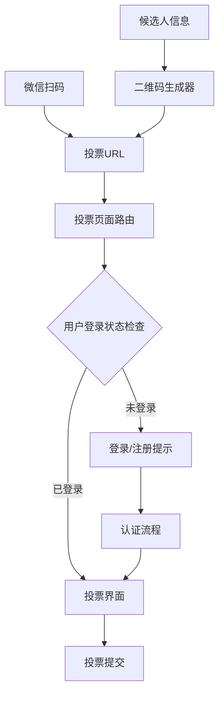

# 设计文档

## 概述

本设计将现有的个人信息二维码系统改造为投票URL二维码系统。核心思路是将二维码内容从静态个人信息转换为动态投票链接，用户扫码后直接跳转到投票页面，系统根据用户登录状态提供相应的投票或认证界面。

## 架构

### 系统架构图



### 核心组件

1. **QR Code URL Generator**: 负责生成包含投票参数的URL并转换为二维码
2. **Vote Page Router**: 处理投票页面路由和参数解析
3. **Authentication Guard**: 检查用户登录状态并控制页面访问
4. **Vote Interface**: 提供投票功能的用户界面
5. **Login Prompt**: 为未登录用户提供认证入口

## 组件和接口

### QR Code URL Generator

```typescript
interface QRCodeURLGenerator {
  generateVotingURL(candidateInfo: CandidateInfo): string;
  generateQRCode(url: string): QRCodeData;
  validateURL(url: string): boolean;
}

interface CandidateInfo {
  id: string;
  name: string;
  category?: string;
  metadata?: Record<string, any>;
}

interface QRCodeData {
  imageData: string;
  url: string;
  timestamp: Date;
}
```

### Vote Page Router

```typescript
interface VotePageRouter {
  parseURLParams(url: string): VotePageParams;
  validateParams(params: VotePageParams): ValidationResult;
  renderVotePage(params: VotePageParams): VotePageComponent;
}

interface VotePageParams {
  candidateId: string;
  candidateName: string;
  category?: string;
  source: 'qrcode' | 'direct';
  timestamp?: string;
}

interface ValidationResult {
  isValid: boolean;
  errors: string[];
  sanitizedParams?: VotePageParams;
}
```

### Authentication Guard

```typescript
interface AuthenticationGuard {
  checkLoginStatus(): Promise<AuthStatus>;
  requireAuthentication(): Promise<User | null>;
  redirectToLogin(returnUrl: string): void;
}

interface AuthStatus {
  isLoggedIn: boolean;
  user?: User;
  sessionExpiry?: Date;
}

interface User {
  id: string;
  username: string;
  email: string;
  hasVotingRights: boolean;
}
```

### Vote Interface

```typescript
interface VoteInterface {
  displayCandidate(candidate: CandidateInfo): void;
  submitVote(candidateId: string, userId: string): Promise<VoteResult>;
  checkExistingVote(candidateId: string, userId: string): Promise<boolean>;
  showVoteConfirmation(result: VoteResult): void;
}

interface VoteResult {
  success: boolean;
  message: string;
  voteId?: string;
  timestamp?: Date;
}
```

## 数据模型

### URL参数结构

投票URL将包含以下参数：
- `candidate_id`: 被投票人唯一标识符
- `candidate_name`: 被投票人姓名（用于显示）
- `category`: 投票类别（可选）
- `source`: 来源标识（qrcode）
- `timestamp`: 生成时间戳（用于验证）

示例URL：
```
https://domain.com/vote?candidate_id=12345&candidate_name=张三&category=最佳员工&source=qrcode&timestamp=1640995200
```

### 数据验证规则

1. **candidate_id**: 必须是有效的数字或字符串ID
2. **candidate_name**: 非空字符串，长度限制1-50字符
3. **category**: 可选，如果提供则必须是预定义的类别之一
4. **source**: 必须是'qrcode'
5. **timestamp**: 必须是有效的Unix时间戳，且不能超过24小时

### 安全考虑

1. **参数编码**: 所有URL参数使用URL编码防止特殊字符问题
2. **参数验证**: 服务端严格验证所有参数格式和内容
3. **时间戳验证**: 防止重放攻击，URL有效期限制为24小时
4. **候选人验证**: 确保candidate_id对应真实存在的候选人

## 正确性属性

*属性是一个特征或行为，应该在系统的所有有效执行中保持为真——本质上是关于系统应该做什么的正式声明。属性作为人类可读规范和机器可验证正确性保证之间的桥梁。*

### 属性 1: URL生成和参数完整性
*对于任何*有效的候选人信息，生成的投票URL应该包含候选人ID、姓名和所有必要的投票参数，且参数格式正确
**验证需求: 1.1, 1.2**

### 属性 2: URL参数解析准确性  
*对于任何*包含有效投票参数的URL，参数解析函数应该能够正确提取所有候选人信息和投票相关数据
**验证需求: 2.1**

### 属性 3: URL参数验证完整性
*对于任何*输入的URL参数集合，验证函数应该正确识别有效参数并拒绝无效或不完整的参数
**验证需求: 2.3**

### 属性 4: 用户认证状态检查一致性
*对于任何*用户会话状态，认证系统应该准确返回用户的登录状态和相关权限信息
**验证需求: 3.1**

### 属性 5: 投票数据验证严格性
*对于任何*投票提交数据，验证系统应该确保数据格式正确、候选人ID有效且用户具有投票权限
**验证需求: 4.2**

### 属性 6: 防重复投票机制有效性
*对于任何*用户和候选人组合，如果已存在投票记录，系统应该阻止重复投票并保持数据一致性
**验证需求: 4.5**

### 属性 7: 用户状态保持连续性
*对于任何*用户在登录流程中的状态转换，候选人信息和投票上下文应该在整个过程中保持不变
**验证需求: 5.3**

### 属性 8: 安全参数处理防护性
*对于任何*包含特殊字符或潜在恶意内容的输入参数，系统应该正确编码、验证并防止注入攻击
**验证需求: 7.1, 7.2**

## 错误处理

### 错误类型和处理策略

1. **URL参数错误**
   - 缺失必要参数：显示友好错误页面，提供返回主页链接
   - 参数格式错误：记录错误日志，显示参数无效提示
   - 候选人ID不存在：显示候选人不存在错误，提供搜索功能

2. **认证错误**
   - 会话过期：自动跳转到登录页面，保留投票上下文
   - 权限不足：显示权限不足提示，提供联系管理员选项
   - 认证服务不可用：显示临时不可用提示，提供重试选项

3. **投票错误**
   - 重复投票：显示已投票提示，提供查看投票结果选项
   - 投票服务异常：显示服务异常提示，提供稍后重试选项
   - 网络错误：显示网络错误提示，提供重试按钮

4. **兼容性错误**
   - 浏览器不支持：显示浏览器兼容性提示，推荐使用微信浏览器
   - 移动端适配问题：自动调整布局，确保核心功能可用

## 测试策略

### 双重测试方法

本系统采用单元测试和基于属性的测试相结合的方法：

**单元测试**：
- 验证特定示例和边界情况
- 测试组件间的集成点
- 验证错误条件和异常处理
- 重点关注具体的业务逻辑实现

**基于属性的测试**：
- 验证跨所有输入的通用属性
- 通过随机化实现全面的输入覆盖
- 每个属性测试最少运行100次迭代
- 每个测试必须引用其设计文档属性
- 标签格式：**Feature: qr-code-voting-url, Property {number}: {property_text}**

### 测试配置要求

1. **属性测试配置**：
   - 使用适合目标语言的属性测试库（如JavaScript的fast-check）
   - 每个属性测试最少100次迭代以确保充分的随机化覆盖
   - 每个属性测试必须明确引用对应的设计属性编号

2. **测试数据生成**：
   - 候选人信息生成器：生成各种有效和边界情况的候选人数据
   - URL参数生成器：生成包含特殊字符、边界长度的参数组合
   - 用户状态生成器：模拟各种登录状态和权限组合

3. **集成测试重点**：
   - 二维码生成到URL解析的完整流程
   - 用户认证状态变化对投票流程的影响
   - 错误处理在各个组件间的传播和处理

### 测试覆盖目标

- 核心业务逻辑：100%代码覆盖
- 错误处理路径：90%覆盖
- 边界条件和异常情况：完全覆盖
- 跨浏览器兼容性：主流浏览器和微信浏览器测试