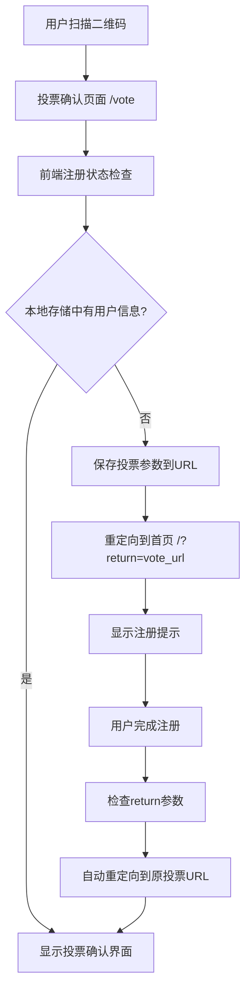

# 设计文档

## 概述

本设计文档描述了投票前用户注册验证功能的技术实现方案。该功能在现有的Node.js投票系统中添加注册状态检查逻辑，与现有的本地存储用户状态管理机制完全兼容，确保只有已注册用户才能访问投票确认页面，同时通过URL参数和本地存储保持投票流程的连续性。

## 架构

### 系统架构图



### 组件架构

系统基于现有架构进行扩展，主要组件包括：

1. **前端注册验证逻辑** (扩展现有的`VotePageRouter`)
   - 检查本地存储中的用户注册状态
   - 管理投票URL参数的保存和恢复
   - 处理重定向逻辑

2. **首页注册流程增强** (扩展现有的`app.js`)
   - 检测return参数并显示相应提示
   - 注册完成后自动重定向到原投票页面
   - 与现有的本地存储机制集成

3. **URL参数管理** (新增工具函数)
   - 构建包含投票信息的return URL
   - 解析和验证return URL参数
   - 处理URL编码/解码

4. **本地存储扩展** (扩展现有的存储键)
   - 复用现有的用户状态存储机制
   - 添加临时投票意图存储
   - 保持与现有缓存策略的一致性

## 组件和接口

### 前端注册验证逻辑 (扩展VotePageRouter)

```javascript
// src/components/vote-page.html (扩展现有的VotePageRouter类)
class VotePageRouter {
  // 扩展现有的checkAuthStatus方法
  async checkAuthStatus() {
    // 检查现有的本地存储键
    const userId = localStorage.getItem('annual_party_user_id');
    const userName = localStorage.getItem('annual_party_user_name');
    const registrationTime = localStorage.getItem('annual_party_registration_time');
    
    // 验证注册信息的有效性
    if (userId && userName && this.isRegistrationValid(registrationTime)) {
      return {
        isLoggedIn: true,
        user: { id: userId, name: userName }
      };
    }
    
    return { isLoggedIn: false };
  }

  // 新增：保存投票意图并重定向
  redirectToRegistration() {
    const returnUrl = this.buildReturnUrl();
    const registrationUrl = `/?return=${encodeURIComponent(returnUrl)}`;
    window.location.href = registrationUrl;
  }

  // 新增：构建包含投票信息的返回URL
  buildReturnUrl() {
    const currentUrl = window.location.href;
    return currentUrl;
  }
}
```

### 首页注册流程增强 (扩展app.js)

```javascript
// public/static/js/app.js (扩展现有功能)

// 扩展现有的DOMContentLoaded事件处理
document.addEventListener('DOMContentLoaded', function() {
  // 现有的初始化逻辑...
  
  // 新增：检查return参数
  checkReturnParameter();
  
  // 现有的注册表单处理...
});

// 新增：检查并处理return参数
function checkReturnParameter() {
  const urlParams = new URLSearchParams(window.location.search);
  const returnUrl = urlParams.get('return');
  
  if (returnUrl) {
    // 保存return URL到本地存储
    localStorage.setItem('pending_return_url', returnUrl);
    
    // 显示投票相关的注册提示
    showVoteRegistrationPrompt(returnUrl);
  }
}

// 新增：显示投票注册提示
function showVoteRegistrationPrompt(returnUrl) {
  const promptDiv = document.createElement('div');
  promptDiv.className = 'vote-registration-prompt';
  promptDiv.innerHTML = `
    <div class="prompt-content">
      <h3>🗳️ 投票前需要注册</h3>
      <p>您需要先注册才能参与投票，注册完成后将自动返回投票页面。</p>
    </div>
  `;
  
  // 插入到注册表单前
  const form = document.getElementById('registerForm');
  form.parentNode.insertBefore(promptDiv, form);
}

// 扩展现有的注册成功处理逻辑
async function confirmGender() {
  // 现有的注册逻辑...
  
  if (result.success) {
    // 现有的本地存储逻辑...
    
    // 新增：检查是否有待处理的返回URL
    const pendingReturnUrl = localStorage.getItem('pending_return_url');
    if (pendingReturnUrl) {
      localStorage.removeItem('pending_return_url');
      
      showMessage('注册成功！正在返回投票页面...', 'success');
      
      setTimeout(() => {
        window.location.href = pendingReturnUrl;
      }, 1500);
      return;
    }
    
    // 现有的默认跳转逻辑...
  }
}
```

### URL参数管理工具

```javascript
// public/static/js/urlUtils.js (新增工具文件)
class URLUtils {
  static buildReturnUrl(baseUrl, params = {}) {
    const url = new URL(baseUrl, window.location.origin);
    
    // 添加参数
    Object.entries(params).forEach(([key, value]) => {
      if (value !== null && value !== undefined) {
        url.searchParams.set(key, value);
      }
    });
    
    return url.toString();
  }

  static parseReturnUrl(returnUrl) {
    try {
      const url = new URL(returnUrl, window.location.origin);
      
      // 验证URL安全性
      if (url.origin !== window.location.origin) {
        throw new Error('Invalid return URL origin');
      }
      
      return {
        pathname: url.pathname,
        searchParams: Object.fromEntries(url.searchParams),
        isValid: true
      };
    } catch (error) {
      console.error('Invalid return URL:', error);
      return { isValid: false };
    }
  }

  static sanitizeReturnUrl(returnUrl) {
    const parsed = this.parseReturnUrl(returnUrl);
    return parsed.isValid ? returnUrl : '/';
  }
}
```

### 本地存储扩展

```javascript
// 扩展现有的STORAGE_KEYS常量
const STORAGE_KEYS = {
  // 现有的键...
  USER_ID: 'annual_party_user_id',
  USER_NAME: 'annual_party_user_name',
  USER_GENDER: 'annual_party_user_gender',
  NUMERIC_ID: 'annual_party_numeric_id',
  REGISTRATION_TIME: 'annual_party_registration_time',
  
  // 新增的键
  PENDING_RETURN_URL: 'pending_return_url',
  VOTE_INTENT_TIMESTAMP: 'vote_intent_timestamp'
};

// 新增：验证注册信息有效性
function isRegistrationValid(registrationTime) {
  if (!registrationTime) return false;
  
  const regTime = new Date(registrationTime);
  const now = new Date();
  const hoursDiff = (now - regTime) / (1000 * 60 * 60);
  
  // 24小时内的注册被认为是有效的
  return hoursDiff < 24;
}
```

## 数据模型

### 本地存储数据结构 (扩展现有结构)

```javascript
// 现有的本地存储键 (保持不变)
const ExistingStorageKeys = {
  USER_ID: 'annual_party_user_id',
  USER_NAME: 'annual_party_user_name', 
  USER_GENDER: 'annual_party_user_gender',
  NUMERIC_ID: 'annual_party_numeric_id',
  REGISTRATION_TIME: 'annual_party_registration_time'
};

// 新增的本地存储键
const NewStorageKeys = {
  PENDING_RETURN_URL: 'pending_return_url',
  VOTE_INTENT_TIMESTAMP: 'vote_intent_timestamp'
};
```

### Return URL参数结构

```javascript
const ReturnUrlStructure = {
  // 基础投票URL，例如: /vote?candidate_id=123&candidate_name=张三
  baseUrl: String,
  
  // URL参数对象
  params: {
    candidate_id: String,      // 候选人ID
    candidate_name: String,    // 候选人姓名
    source: String,           // 来源 (qrcode/direct)
    category: String,         // 分类 (可选)
    timestamp: String         // 时间戳 (可选)
  }
};
```

### 投票意图临时数据

```javascript
const VoteIntentData = {
  returnUrl: String,        // 完整的返回URL
  timestamp: Date,          // 保存时间
  userAgent: String,        // 用户代理 (用于验证)
  expiresAt: Date          // 过期时间 (24小时后)
};
```

## 正确性属性

*属性是一个特征或行为，应该在系统的所有有效执行中保持为真——本质上，是关于系统应该做什么的正式陈述。属性作为人类可读规范和机器可验证正确性保证之间的桥梁。*

基于需求分析，以下是系统的核心正确性属性：

### 属性 1: 注册状态验证正确性
*对于任何*用户访问投票确认页面的请求，系统应该正确检查注册状态，并且已注册用户能够访问而未注册用户被阻止访问
**验证需求: 1.1, 1.2, 1.3**

### 属性 2: 未注册用户重定向和意图保存
*对于任何*未注册用户尝试访问投票确认页面，系统应该将用户重定向到首页并同时保存投票意图信息
**验证需求: 2.1, 2.2**

### 属性 3: 投票意图会话持久性
*对于任何*保存的投票意图数据，在用户会话期间应该始终可以被正确检索和验证
**验证需求: 2.4**

### 属性 4: 注册完成后意图检查
*对于任何*用户完成注册的事件，系统应该检查是否存在待处理的投票意图
**验证需求: 3.1**

### 属性 5: 投票意图恢复和重定向
*对于任何*存在待处理投票意图的已注册用户，系统应该自动重定向到投票确认页面并恢复之前保存的投票信息
**验证需求: 3.2, 3.3**

### 属性 6: 无意图时的默认行为
*对于任何*没有待处理投票意图的已注册用户，系统应该将用户保留在首页
**验证需求: 3.4**

### 属性 7: 错误处理和日志记录
*对于任何*验证过程中发生的错误，系统应该记录详细的错误信息并优雅地处理异常
**验证需求: 4.3**

### 属性 8: 审计日志完整性
*对于任何*用户重定向、注册完成、验证错误等关键操作，系统应该记录包含时间戳、用户标识和操作类型的完整审计日志
**验证需求: 6.1, 6.2, 6.3, 6.4**

## 错误处理

### 错误类型和处理策略

1. **本地存储访问失败**
   - 存储空间不足：清理过期数据，提示用户
   - 浏览器禁用存储：使用URL参数作为备用方案
   - 数据损坏：清理损坏数据，重新开始流程

2. **URL参数处理失败**
   - URL格式错误：使用默认投票页面
   - 参数缺失：提示用户重新扫描二维码
   - 参数过期：清理过期参数，引导重新开始

3. **重定向处理失败**
   - 循环重定向：检测并中断循环，显示错误页面
   - 无效返回URL：使用安全的默认页面
   - 网络错误：提供手动导航选项

### 错误恢复机制

```javascript
// 扩展现有的错误处理逻辑
class ErrorHandler {
  static handleStorageError(error, fallbackAction) {
    console.error('Local storage error:', error);
    
    // 尝试清理存储
    try {
      localStorage.clear();
    } catch (clearError) {
      console.error('Failed to clear storage:', clearError);
    }
    
    // 执行备用操作
    if (typeof fallbackAction === 'function') {
      fallbackAction();
    }
  }

  static handleUrlError(error, returnUrl) {
    console.error('URL processing error:', error);
    
    // 验证并清理URL
    const safeUrl = URLUtils.sanitizeReturnUrl(returnUrl);
    return safeUrl;
  }

  static handleRedirectError(error, defaultPath = '/') {
    console.error('Redirect error:', error);
    
    // 使用安全的默认重定向
    window.location.href = defaultPath;
  }
}
```

## 测试策略

### 双重测试方法

本系统采用单元测试和基于属性的测试相结合的方法：

**单元测试**：
- 验证特定的示例和边界情况
- 测试错误条件和异常处理
- 验证组件间的集成点
- 测试具体的业务逻辑场景

**基于属性的测试**：
- 验证跨所有输入的通用属性
- 通过随机化实现全面的输入覆盖
- 测试系统在各种条件下的正确性保证
- 发现边界情况和意外的输入组合

### 基于属性的测试配置

- **测试库**：使用fast-check（JavaScript的属性测试库）
- **迭代次数**：每个属性测试最少100次迭代
- **测试标记**：每个测试用注释引用设计文档属性
- **标记格式**：**Feature: vote-registration-verification, Property {number}: {property_text}**

### 测试覆盖范围

**单元测试重点**：
- 中间件函数的具体行为
- 会话管理的边界情况
- URL构建和解析的正确性
- 错误处理的具体场景

**属性测试重点**：
- 注册状态检查的一致性
- 投票意图数据的完整性
- 重定向逻辑的正确性
- 日志记录的完整性

每个正确性属性必须由单个基于属性的测试实现，确保系统在所有有效输入下的正确行为。

### 实现注意事项

### 与现有系统的兼容性

1. **本地存储兼容性**：完全复用现有的存储键和数据结构
2. **注册流程兼容性**：扩展而不是替换现有的注册逻辑
3. **URL路由兼容性**：保持现有的页面路由不变
4. **用户体验一致性**：保持与现有UI风格和交互模式一致

### 性能考虑

1. **本地存储优化**：最小化存储操作，复用现有缓存策略
2. **URL参数优化**：使用压缩的参数格式减少URL长度
3. **重定向优化**：减少不必要的页面跳转
4. **前端性能**：复用现有的JavaScript模块和样式

### 安全考虑

1. **URL安全**：严格验证返回URL防止开放重定向攻击
2. **本地存储安全**：验证存储数据的完整性
3. **参数验证**：对所有URL参数进行严格验证
4. **时间戳验证**：防止重放攻击和过期链接使用

### 可维护性

1. **代码复用**：最大化复用现有代码和工具函数
2. **配置管理**：使用现有的配置模式和常量定义
3. **错误处理**：与现有的错误处理机制保持一致
4. **测试集成**：与现有的测试框架和模式集成